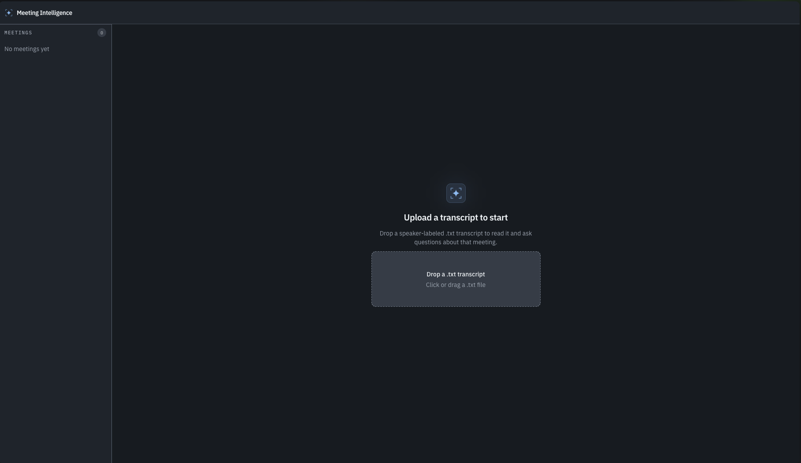
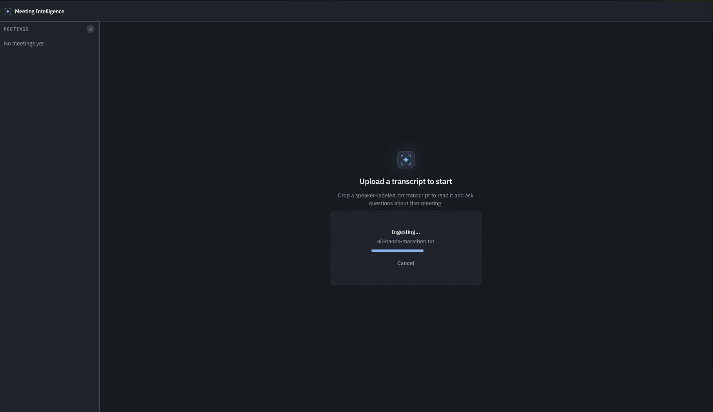
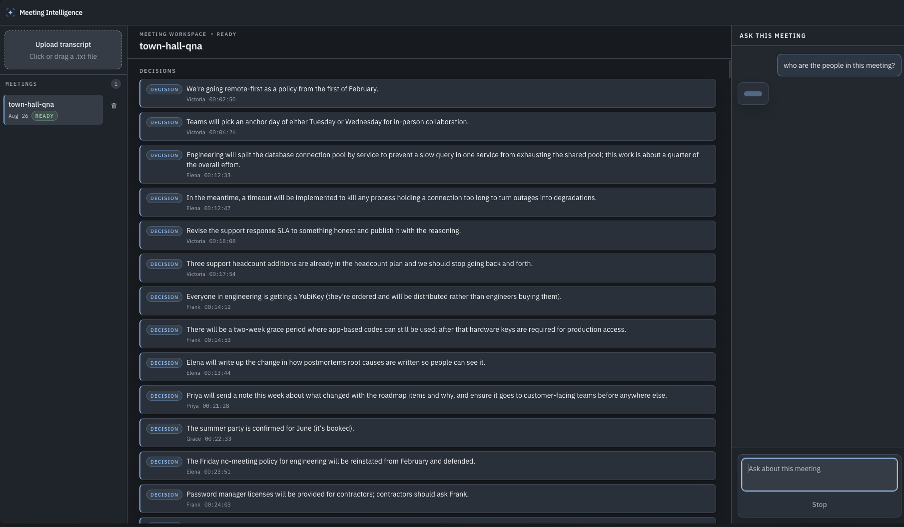
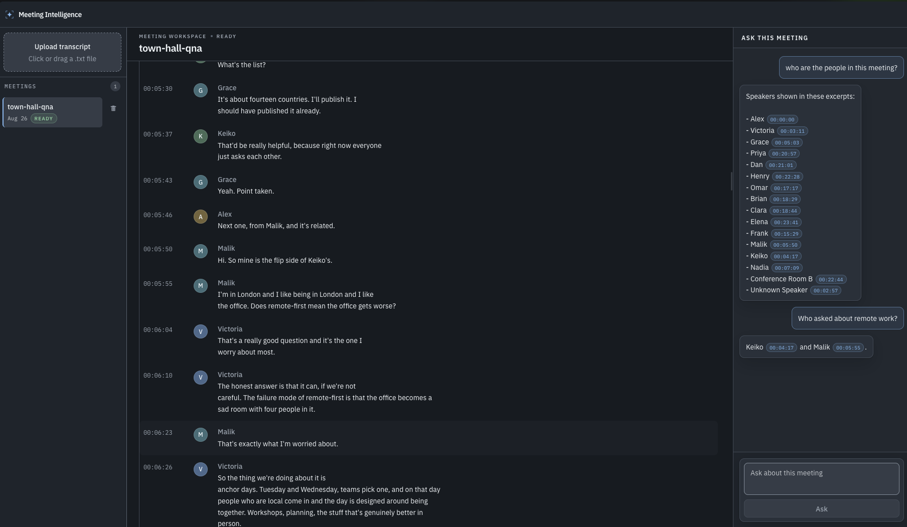

# Meeting Intelligence

Upload a speaker-labeled meeting transcript, then ask questions about **that** meeting’s discussion, decisions, and action items.

Chat never mixes meetings. Leaving a meeting (or clicking **Stop**) aborts an in-flight answer.

## Contents

- [Screenshots](#screenshots)
- [Ingestion and retrieval](docs/flows/README.md)
- [Requirements](#requirements)
- [Installation](#installation)
- [Run](#run)
- [Docker](#docker)
- [First transcript](#first-transcript)
- [How a question is answered](#how-a-question-is-answered)
- [Transcript format](#transcript-format)
- [Data](#data)
- [Checks](#checks)

UI screenshots are in [docs/screenshots](docs/screenshots/). Ingestion and retrieval diagrams (and the files that implement them) are in [docs/flows](docs/flows/README.md).

## Screenshots

| File                                | What                                                               |
| ----------------------------------- | ------------------------------------------------------------------ |
| [`01.png`](docs/screenshots/01.png) | Empty state: drop or click-select a `.txt` transcript.             |
| [`02.png`](docs/screenshots/02.png) | Ingest in progress (`Ingesting…`, with Cancel).                    |
| [`03.png`](docs/screenshots/03.png) | A ready meeting: extracted **decisions** and **Ask this meeting**. |
| [`04.png`](docs/screenshots/04.png) | Transcript plus a cited answer (chips scroll to the turn).         |









## Requirements

- [Node.js](https://nodejs.org/) **24** or later (built-in `node:sqlite`, `--watch`, and `--env-file-if-exists`). Pin with [`.nvmrc`](.nvmrc).
- An [OpenAI API key](https://platform.openai.com/api-keys) and network access to the chat and embedding API.

Chat and embeddings use one official OpenAI SDK client. `OPENAI_BASE_URL` defaults to `https://api.openai.com/v1`. Point it at a remote OpenAI-compatible HTTP API if you use a proxy; document and query strings are sent unchanged.

## Installation

From the repo root:

```bash
npm install
cp .env.example .env
```

That installs the `server` and `web` workspaces. `.env` is gitignored.

Set `OPENAI_API_KEY` in `.env`. It is required and must be non-empty. The other variables already match the defaults in [`.env.example`](.env.example) and in `loadConfig`:

| Variable                      | Default                     |
| ----------------------------- | --------------------------- |
| `OPENAI_BASE_URL`             | `https://api.openai.com/v1` |
| `CHAT_MODEL`                  | `gpt-5-mini`                |
| `EMBEDDING_MODEL`             | `text-embedding-3-small`    |
| `EMBEDDING_DIMENSIONS`        | `1536`                      |
| `DATABASE_PATH`               | `data/app.db`               |
| `FULL_CONTEXT_CHAR_THRESHOLD` | `24000`                     |
| `RETRIEVE_K`                  | `8`                         |
| `FTS_K`                       | `8`                         |
| `CHAT_HISTORY_TURNS`          | `8`                         |
| `PORT`                        | `3000`                      |

## Run

The server loads `../.env` from the `server/` workspace (`--env-file-if-exists`). Config is read at process start, so restart `npm run dev` after changing `.env`.

```bash
npm run dev
```

That starts both processes:

| Process     | URL                                            | Role                                               |
| ----------- | ---------------------------------------------- | -------------------------------------------------- |
| Vite UI     | [http://localhost:5173](http://localhost:5173) | React app. Browser origin. `/api` is proxied here. |
| Fastify API | `http://127.0.0.1:3000`                        | Ingest, SQLite, chat. Bound to loopback.           |

Open **http://localhost:5173**. The Vite proxy forwards `/api` to port **3000** (that target is hardcoded in `web/vite.config.ts`, so keep `PORT=3000` unless you change the proxy too).

```bash
curl -s http://localhost:5173/api/health
```

Expect `{ "ok": true, "chatModel": "gpt-5-mini", "embeddingModel": "text-embedding-3-small" }` when using the defaults.

Ingest **always** embeds. Chat **re-embeds** a meeting only when its stored `embedding_model` / `embedding_dimensions` do not match `.env` **and** the question uses retrieval. Full-transcript chats skip that reindex (the stored vectors are unused). There is one vector per chunk; a reindex replaces it.

## Docker

One image serves the Vite UI and the Fastify API on port **3000**. SQLite lives on a volume. Secrets stay out of the image — pass them at run time.

```bash
cp .env.example .env   # set OPENAI_API_KEY
docker compose up --build
```

Open **http://localhost:3000**.

```bash
curl -s http://localhost:3000/api/health
```

`HOST=0.0.0.0` is set in the image so the process is reachable from outside the container. Local `npm run dev` still binds loopback (`127.0.0.1`).

Without Compose:

```bash
docker build -t meeting-intelligence .
docker run --rm -p 3000:3000 --env-file .env -v meeting-data:/app/data meeting-intelligence
```

## First transcript

1. On the empty state (**Upload a transcript to start**), drop or click-select [`fixtures/transcripts/planning.txt`](fixtures/transcripts/planning.txt).
2. The app ingests the file and opens that meeting. You get the transcript plus extracted **decisions** and **action items**.
3. Ask **What are the action items?**

Expect those four owned follow-ups — Omar’s storage RFC by Monday, Priya’s workspace mockups by Wednesday, Sam’s soak test by Thursday, and Maya’s legal retention review next Tuesday. The owners and due days are stated in the transcript; the model may rephrase the wording.

Eleven sample transcripts live under [`fixtures/`](fixtures/README.md), written to read like real transcription-service exports — turns wrapped mid-sentence, filler words, `[inaudible]` markers, diarisation failures — and sized to reach every limit in the pipeline, including ones large enough to force retrieval. That page lists each file’s size, format, and a question with the answer to expect.

## How a question is answered

Uploading parses turns, packs them into chunks (~2000 characters), stores them in SQLite, and **in parallel** embeds those chunks and extracts decisions and action items from overlapping ~12k-character windows (then one reconcile pass if there is more than one window).

Asking a question is always `WHERE meeting_id = ?`:

- If the transcript is **under** `FULL_CONTEXT_CHAR_THRESHOLD` (24000 characters in `.env.example`), the model sees the **full transcript**. `planning.txt` takes this path.
- If it is **at or above** the threshold, the API retrieves a handful of chunks (vector similarity + SQLite FTS, fused) and prompts with those excerpts plus the extracted facts.

Either way the answer's citations become chips that scroll the transcript to the cited turn, and only what the answer actually cites gets a chip. Full-transcript answers also carry a **Full transcript** badge, since the whole file was in the prompt rather than a handful of excerpts.

Each chunk names its turns as `[Speaker, timestamp]:` — the same shape as a citation — and keeps clocks out of its header. Copying the marker from the turn that contains the claim is what stops a citation landing on that speaker's first greeting.

The cited clock is still only the model's guess, so the web app checks it against the transcript before drawing a chip: among that speaker's turns it picks the one whose words the claim actually shares, and leaves the citation alone when nothing matches better. That is why "who asked about remote work?" points at Keiko's question rather than the "Hi, can you hear me?" three seconds earlier.

## Transcript format

UTF-8 `.txt` only, up to **5 MiB**. The filename must end in `.txt`. Canonical line:

```text
[HH:MM:SS] Speaker: utterance
```

Also accepted:

```text
[MM:SS] Speaker: utterance
Speaker (HH:MM:SS): utterance
Speaker (MM:SS): utterance
HH:MM:SS Speaker: utterance
```

Bare clocks (no brackets or parentheses) must be three parts (`H:MM:SS` / `HH:MM:SS`). `01:02 Ada: hello` is not a turn header.

A non-header line **after** the first turn continues that turn. Lines before the first header, and blank lines, are ignored. A file that yields no turns is rejected (`400`).

BOM is stripped. Continuation lines matter more than they look: transcription services wrap a single turn across several lines, breaking on pauses rather than on grammar, so most turns in a real export are multi-line. A phrase can therefore straddle a newline **inside** one turn — collapse whitespace before matching text against turn content.

## Data

| Path                                    | What                                                                                                                                                                                                                          |
| --------------------------------------- | ----------------------------------------------------------------------------------------------------------------------------------------------------------------------------------------------------------------------------- |
| `DATABASE_PATH` (default `data/app.db`) | SQLite + `sqlite-vec`. With `npm run dev`, the API cwd is `server/`, so the file is `server/data/app.db`. In Docker, Compose stores it at `/app/data/app.db` on a named volume. The API creates the directory on first start. |
| `.env`                                  | `OPENAI_API_KEY` and optional overrides.                                                                                                                                                                                      |

Do not commit `data/`, `*.db`, or `.env`. Meetings, turns, chunks, embeddings, extracted facts, and chat messages all live in that SQLite file.

Chunks are written once, at upload. Nothing re-chunks an existing meeting, so after pulling a change to chunking or citation rendering, re-upload the transcript — or delete `server/data/app.db` — to see it. Stored answers are history and are never rewritten.

## Checks

```bash
npm test          # Node test runner in each workspace
npm run typecheck
npm run lint
```

Ingestion and retrieval diagrams (with the implementing files) are in [docs/flows](docs/flows/README.md).
