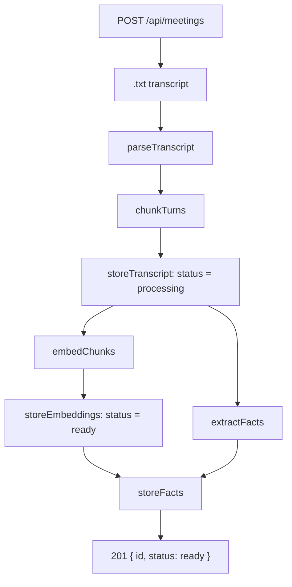
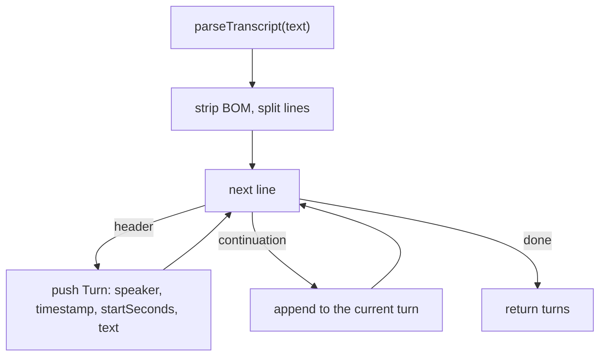
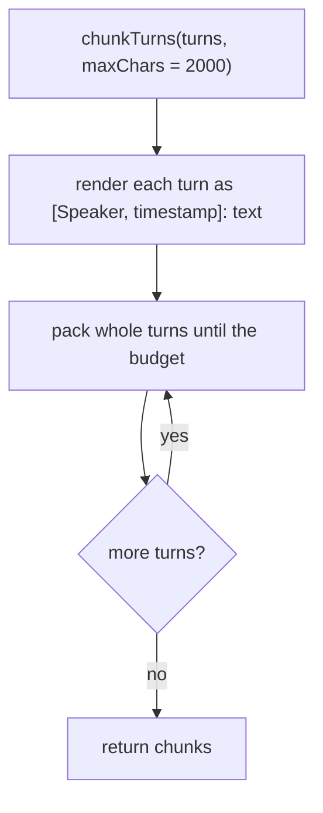
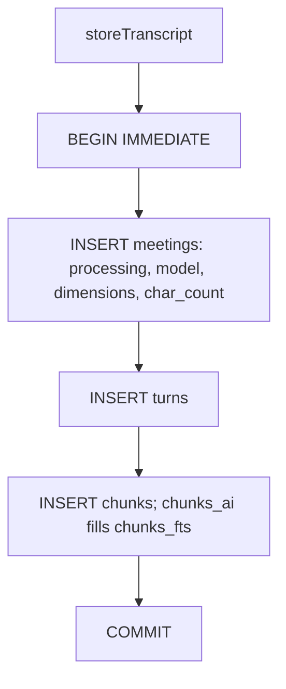
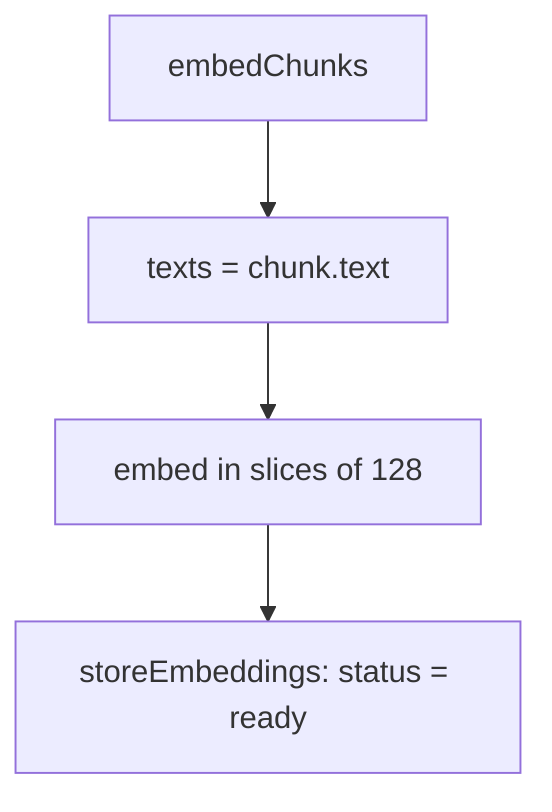
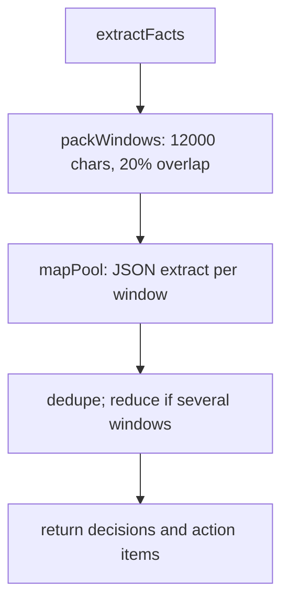

# Ingestion flow

Upload a `.txt` transcript. The server parses speaker turns, packs them into chunks, writes SQLite rows, then embeds those chunks **in parallel with** extracting decisions and action items.

The upload request stays open until ingest finishes, then returns `201 { id, status: ready }`.

## High-level ingestion



HTTP entry: [`server/src/routes/meetings.ts`](../../server/src/routes/meetings.ts). Orchestration: [`server/src/ingest/pipeline.ts`](../../server/src/ingest/pipeline.ts) `ingestTranscript`.

- The `.txt` transcript is form field `file`. The meeting title is the filename without `.txt`.
- Parse and chunk run **before** any `meetings` row exists.
- Embed and extract start together (embed first). After embeddings commit `ready`, the pipeline waits for extract and writes facts.

## Parsing



[`server/src/transcript/parse.ts`](../../server/src/transcript/parse.ts)

Three header forms, first match wins:

- `[00:02:01] Ada: text`
- `Ada (00:02:01): text`
- `00:02:01 Ada: text`

`startSeconds` is derived from the clock. Later non-header lines append to the current turn.

## Chunking



[`server/src/transcript/chunk.ts`](../../server/src/transcript/chunk.ts)

Packed `text` looks like:

```
Speakers: Ada, Ben
[Ada, 00:02:01]: …
[Ben, 00:02:15]: …
```

The `Speakers:` line is a roster only. Citations are the `[Speaker, timestamp]:` markers on each turn — the same rendering used at chat time.

- Whole turns only; a turn is never split. When the previous chunk held more than one turn, the next chunk may repeat that last turn.
- `endSeconds` is the last turn's `startSeconds`. `chunkIndex` is `0 .. n-1`.

## Persisting



[`server/src/ingest/pipeline.ts`](../../server/src/ingest/pipeline.ts) `storeTranscript`, [`server/src/db/schema.sql`](../../server/src/db/schema.sql)

- `char_count` is `rawText.length`. Chat compares it to `FULL_CONTEXT_CHAR_THRESHOLD`.
- `chunks_fts` is FTS5 over `chunks.text`. The `chunks_ai` trigger indexes each row as it is inserted; ingest does not write FTS itself.

## Embedding



[`server/src/llm/embed.ts`](../../server/src/llm/embed.ts) `embed`, [`server/src/ingest/pipeline.ts`](../../server/src/ingest/pipeline.ts) `embedChunks` / `storeEmbeddings`

- The embedded string is the stored chunk `text` (roster plus turns).
- Slices of `EMBED_BATCH_SIZE` (`128`). `text-embedding-3*` also send `dimensions`. Vectors are L2-normalized, then stored as BLOBs.

## Extracting



[`server/src/extract/window.ts`](../../server/src/extract/window.ts), [`server/src/extract/facts.ts`](../../server/src/extract/facts.ts), [`server/src/llm/chat.ts`](../../server/src/llm/chat.ts) `completeJson`

- Windows are packed from turns (not `chunk.text`), so each utterance still has its clock. Mapped at `EXTRACT_CONCURRENCY` (`8`).
- Duplicate fact text collapses to one row. Several windows may get a follow-up reconcile prompt; a single window skips that.
