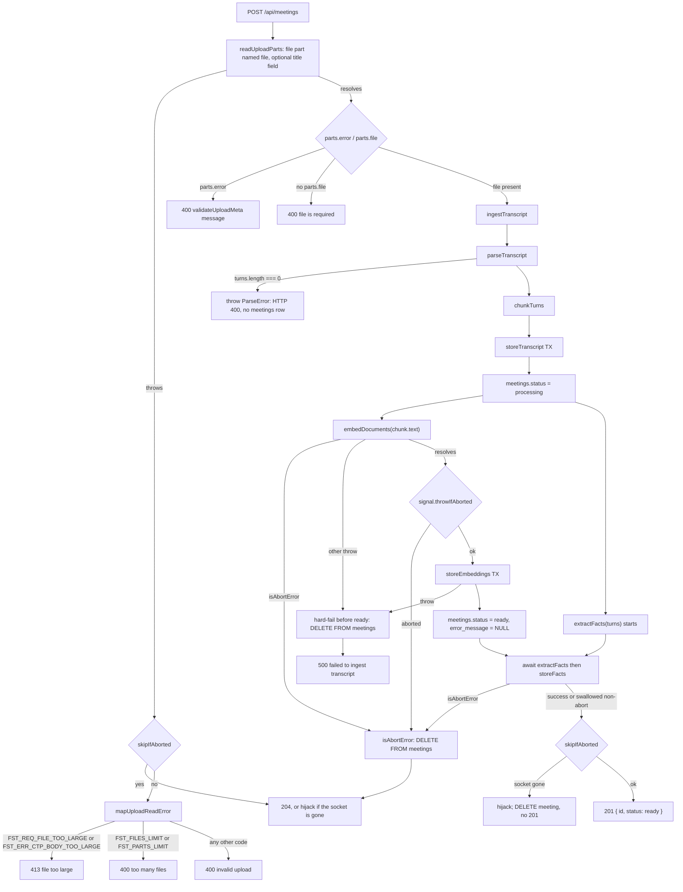
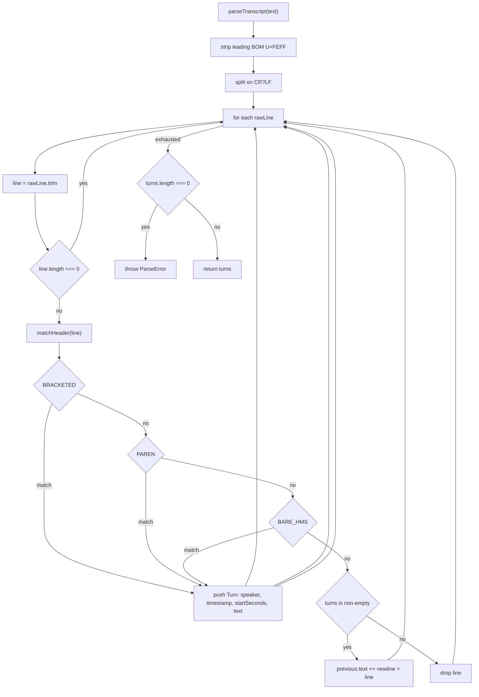
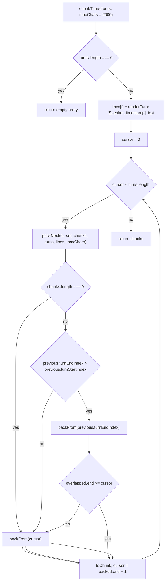
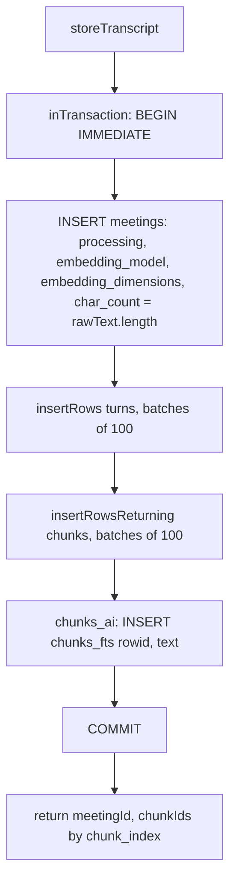
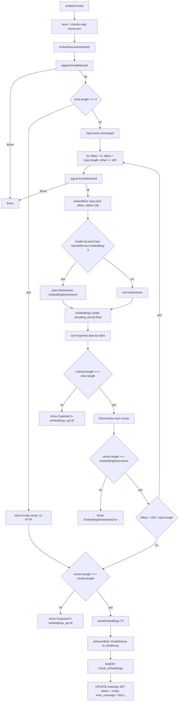
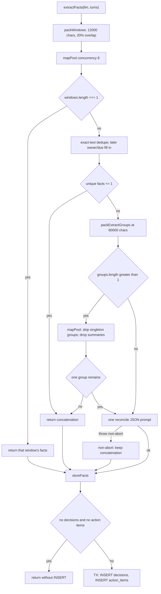
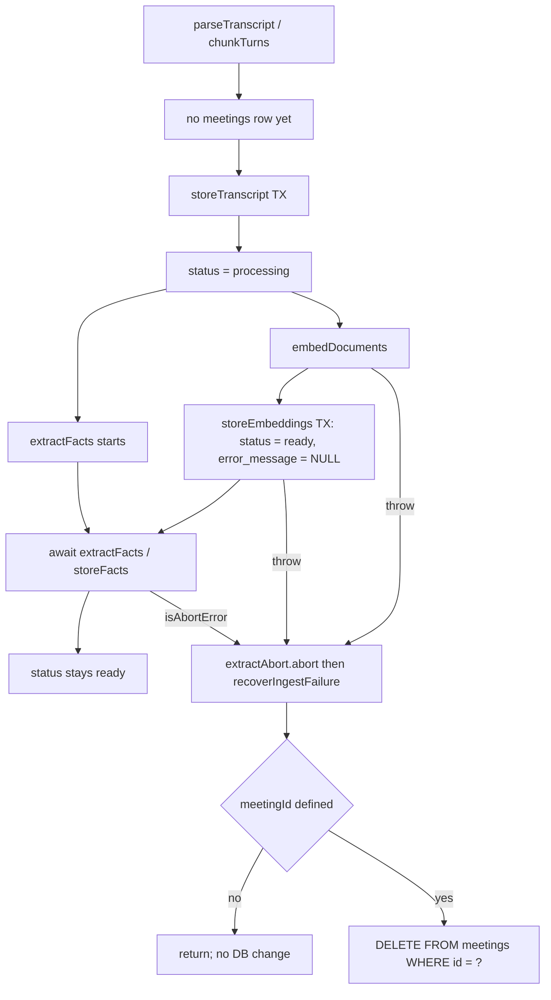

# Ingestion flow

Upload a `.txt` transcript. The server parses speaker turns, packs them into chunks, writes SQLite rows, then embeds those chunk strings **in parallel with** extracting decisions and action items from overlapping transcript windows.

[`meetings.ts`](../../server/src/routes/meetings.ts) calls [`ingestTranscript`](../../server/src/ingest/pipeline.ts). Parse and chunk run **before** any `meetings` row exists.

Ingest is synchronous: the upload request stays open until the meeting is `ready`, so `processing` is a state only concurrent readers observe.

## High-level ingestion

HTTP entry: [`server/src/routes/meetings.ts`](../../server/src/routes/meetings.ts). Orchestration: [`server/src/ingest/pipeline.ts`](../../server/src/ingest/pipeline.ts) `ingestTranscript`.

- The transcript must arrive as the file part named `file`. `validateUploadMeta` requires a filename ending in `.txt` (case-insensitive) and a MIME type that, after trim and lowercase, is empty, `text/plain`, or starts with `text/plain;`. A failed check becomes `400` with that message; no `file` part at all becomes `400 file is required`.
- `files` is `1`, so only one file part ever reaches the handler. A second file part fails the whole request with `400 too many files`, whatever its fieldname. A lone file part under some other fieldname is drained and ignored, which ends as `400 file is required`.
- Size is not checked in `validateUploadMeta`; it is enforced by `@fastify/multipart` `fileSize` (`5 * 1024 * 1024`) and the route `bodyLimit` (`6 * 1024 * 1024`). `mapUploadReadError` turns whatever `readUploadParts` throws into a response by error code:

| Error code                                             | Response             |
| ------------------------------------------------------ | -------------------- |
| `FST_REQ_FILE_TOO_LARGE`, `FST_ERR_CTP_BODY_TOO_LARGE` | `413 file too large` |
| `FST_FILES_LIMIT`, `FST_PARTS_LIMIT`                   | `400 too many files` |
| anything else                                          | `400 invalid upload` |

- `skipIfAborted` runs before that mapping. When a client disappears mid-upload the socket is destroyed, so the reply is hijacked. The error `@fastify/multipart` throws in that case is `FST_MP_PREMATURE_CLOSE`, which is not an `AbortError`, so a premature close on a socket that is somehow still open falls through the table to `400 invalid upload`. Ingest never starts either way.
- `title` is the optional `title` field, trimmed; a later `title` field overwrites an earlier one. When it is missing or blank the title is `filename.replace(/\.txt$/i, '')`.
- `parseTranscript` runs before `storeTranscript`. Zero turns **throws** `ParseError` (it does not return `[]`). `createMeeting` maps that to 400; no `meetings` row exists yet.
- `storeEmbeddings` sets `status = 'ready'` and `error_message = NULL` **before** `storeFacts` returns. Fact extraction **starts** in parallel with embedding, after `storeTranscript` commits. The embed request is issued first so a single-backend queue is not filled by the eight extract calls.
- If embedding fails, `ingestTranscript` aborts the in-flight extract (`AbortSignal.any` with a local controller) so the API call is not left running for a meeting that will be deleted.
- [`recoverIngestFailure`](../../server/src/ingest/pipeline.ts) does nothing when `meetingId` is unset; otherwise it runs `DELETE FROM meetings WHERE id = ?`. An aborted ingest therefore leaves no `meetings` row, even when embeddings had already committed `ready`. A hard failure before `ready` is the same delete; a non-abort extract failure is swallowed and the meeting stays `ready`.
- The status code still separates those two cases: an abort answers **204** through `skipIfAborted` (or hijacks when the socket is already gone), a hard failure answers **500** `failed to ingest transcript`.
- That recovery `DELETE` is itself best-effort. If it fails the error is swallowed, which can leave a `processing` or `ready` row behind but still surfaces the original ingest failure to the client.
- After a successful ingest, `skipIfAborted` may omit the `201` if the client is already gone; [`discardMeeting`](../../server/src/ingest/pipeline.ts) then deletes that row so a cancelled upload never appears in the list.

## Parsing

[`server/src/transcript/parse.ts`](../../server/src/transcript/parse.ts)

- The three header forms are `[00:02:01] Ada: text` (`BRACKETED`), `Ada (00:02:01): text` (`PAREN`), and `00:02:01 Ada: text` (`BARE_HMS`), tried in that order. First match wins, and the captured speaker is trimmed.
- `BRACKETED` and `PAREN` clocks are `\d{1,2}:\d{2}` with an optional `:\d{2}` (`MM:SS` or `H:MM:SS` / `HH:MM:SS`). `BARE_HMS` is `\d{1,2}:\d{2}:\d{2}` (three parts; hours may be one digit). So `01:02 Ada: hello` is not a turn header — a bare clock needs seconds.
- `startSeconds`: two parts → `minutes * 60 + seconds`; three parts → `hours * 3600 + minutes * 60 + seconds`. The `timestamp` string is stored as written.
- A non-header line before any turn is dropped. After the first turn it is a continuation (`previous.text += '\n' + line`).
- Zero turns → `ParseError` with message `Could not parse speaker labels and timestamps. Expected lines like [HH:MM:SS] Speaker: text`.

## Chunking

[`server/src/transcript/chunk.ts`](../../server/src/transcript/chunk.ts)

- Packed `text` is `` `Speakers: ${speakerLabel}\n` `` plus the turn lines joined by `\n`. The header deliberately carries no clock, only the roster; the window range stays on the `startTimestamp`/`endTimestamp` columns for the UI.
- Turn lines come from [`renderTurn`](../../server/src/transcript/parse.ts), the same `[Speaker, timestamp]: text` rendering `packWindows` uses for extraction. The prefix is the citation format, so the model copies rather than rebuilds. Drop the per-turn clock and the only remaining association is "this speaker appeared in the window", which is how a greeting's timestamp gets attached to a later question.
- `text` is written once, at ingest. `reindexMeeting` re-embeds the stored text but never re-chunks it, so a meeting ingested before a change to this rendering keeps its old excerpts. Re-upload the transcript to pick one up.
- `packFrom` always includes `turns[start]`. Further whole turns are added while `candidateLength <= maxChars`. A single turn longer than `2000` stays one chunk; a turn is never split.
- The `2000` budget covers the `[Speaker, timestamp]: ` prefixes, which are roughly 11 characters per turn, so it buys about the same amount of speech per chunk as a clock-free `1800` would.
- `candidateLength` = header length + `1` (the newline after the header) + sum of line lengths + `(lineCount - 1)` (newlines between lines).
- `speakerLabel` lists unique speakers in first-seen order, comma-separated (`Ada, Ben`). The same speaker twice does not duplicate the label.
- Overlap: only when the previous chunk covers more than one turn, try starting again at `previous.turnEndIndex`, so the previous chunk's last turn is repeated. Keep that window only if it reaches `overlapped.end >= cursor`, which guarantees at least one new turn and therefore forward progress. A previous chunk holding a single turn skips overlap entirely.
- Example: if chunk 0 covers turns 0–3, `cursor` is 4 and the next window is tried from turn 3. If it fits turn 4 or beyond it is kept (turn 3 appears in both chunks); if turn 3 alone fills the budget, the retry is discarded and chunk 1 starts at turn 4 with no overlap.
- `endSeconds` is the last turn’s `startSeconds`, not an utterance end time.
- `chunkIndex` is `0 .. n-1` in push order.

## Persisting

[`server/src/ingest/pipeline.ts`](../../server/src/ingest/pipeline.ts) `storeTranscript`, [`server/src/db/schema.sql`](../../server/src/db/schema.sql), [`server/src/db/batch.ts`](../../server/src/db/batch.ts)

- `char_count` is `rawText.length`, the JavaScript string length in UTF-16 code units, not bytes. That is the number compared against `FULL_CONTEXT_CHAR_THRESHOLD` at chat time.
- `chunks_fts` is FTS5 `content='chunks'`, `content_rowid='id'`, `tokenize='porter unicode61'`. Ingest never `INSERT`s into `chunks_fts` itself.
- `chunks_ai` runs after each `chunks` row: `INSERT INTO chunks_fts(rowid, text) VALUES (new.id, new.text)`.
- `chunks_ad` / `chunks_au` keep FTS in sync on delete/update (`INSERT INTO chunks_fts(chunks_fts, rowid, text) VALUES ('delete', ...)`).
- `inTransaction` rejects a Promise-returning callback (the callback must be synchronous).

## Embedding

[`server/src/llm/embed.ts`](../../server/src/llm/embed.ts) `embedDocuments`, [`server/src/ingest/pipeline.ts`](../../server/src/ingest/pipeline.ts) `embedChunks` / `storeEmbeddings`, [`server/src/db/client.ts`](../../server/src/db/client.ts) `toVectorBlob`

- The embedded string is the stored chunk `text` (header plus body), not `raw_text`.
- `embed()` calls `signal.throwIfAborted()` **before** the empty check, so an already-aborted signal throws even when `texts` is empty.
- `embedDocuments` and `embedQueries` share `embed()`. Inputs are sent unchanged. `embed()` calls `embedSlice` on windows of `EMBED_BATCH_SIZE` (`128`), so the count check inside `embedSlice` is per slice; `embedChunks` then checks the concatenated length against `chunks.length` again.
- `text-embedding-3*` (case-insensitive) sends `dimensions` on each slice’s create payload.
- Empty `texts` skips the HTTP call and returns `[]`. Ingest never reaches that case: `parseTranscript` throws on zero turns, so `chunkTurns` always returns at least one chunk. The guard exists because `embed()` is shared with reindex and query embedding.
- `storeEmbeddings` also checks `vector.length === config.embeddingDimensions` before insert, then `UPDATE meetings SET status = 'ready', error_message = NULL`.
- Zero-magnitude vectors are returned unchanged by `l2Normalize`.

## Extracting

[`server/src/extract/window.ts`](../../server/src/extract/window.ts), [`server/src/extract/facts.ts`](../../server/src/extract/facts.ts), [`server/src/extract/pool.ts`](../../server/src/extract/pool.ts), [`server/src/llm/chat.ts`](../../server/src/llm/chat.ts) `completeJson`, [`server/src/ingest/pipeline.ts`](../../server/src/ingest/pipeline.ts) `storeFacts`

Extraction is **map-reduce over turns**, not a single stuffed transcript:

- `packWindows` fills from a cursor until rendered `[Speaker, timestamp]: text` would exceed `WINDOW_MAX_CHARS` (`12_000`). A rendered turn over that budget is sliced to `maxChars` with a 20% stride; each slice keeps `[Speaker, timestamp]:` when the header fits, so an unlabeled wall of text cannot become one oversized prompt.
- The next window starts ~20% back into the previous window (`WINDOW_OVERLAP_RATIO = 0.2`), snapped to a whole turn. If the suffix from the end never reaches 20% (one turn dominates the window), the next window still starts at `previous.turnEnd` so the last packed turn is shared. If that would not advance (`start <= previous.turnStart`, or the next pack would not pass `previous.turnEnd`), the next window starts at `previous.turnEnd + 1`. A single-turn window never overlaps itself.
- Window text is rendered from turns, not `chunk.text`, so each utterance still has its clock. Embedding chunks stay an independent packing with `DEFAULT_MAX_CHARS`.
- Each window is mapped at `EXTRACT_CONCURRENCY` (`8`). Several windows also ask for a short ephemeral `summary` (capped at 1000 characters). A single window asks only for `decisions` and `actionItems`.
- A non-abort throw from one window contributes empty facts for that window; other windows still run. `AbortError` propagates.
- Identical `text` (trimmed, lowercase, collapsed whitespace) collapses to one row. The first wording and timestamp are kept; a later non-null `owner` or `due` fills in.
- One window, or several windows that yield at most one unique fact, skip the LLM reduce.
- Otherwise concatenated summaries plus the deduped fact lists go to the reduce prompt. Summaries are context only. The reduce step copies `text` from the window lists; speaker, timestamp, owner, and due stay the window values. Invented rows are dropped. A unique longer or shorter phrasing maps back to the original wording. If the reply is unreadable, empty, only invented, or rephrases more rows than it copies, the exact-deduped concatenation is stored instead.
- If that packed JSON would exceed `MERGE_MAX_CHARS` (`60_000`), groups are reconciled once (singleton groups skip the LLM) with summaries dropped so the next pack can shrink. At most one follow-up reconcile runs; if more than one group remains, the concatenation is stored. A non-abort reduce failure stores the exact-deduped concatenation.

`completeJson` ([`server/src/llm/chat.ts`](../../server/src/llm/chat.ts)) makes each JSON request:

- It starts with `signal.throwIfAborted()`, then adds `chatSampling(model, 0)`, `jsonReasoningEffort(model)`, and `response_format: json_object`. `chatSampling` omits `temperature` when the model name matches `/^(gpt-5|o1|o3|o4)/i` and otherwise sends `temperature: 0`.
- `jsonReasoningEffort` is **only** on `completeJson` (ingest), not `streamChat`. `gpt-5*chat*` omit the field. `gpt-5-pro` sends `"high"`. `gpt-5.<digit>*` (5.1+) send `reasoning_effort: "none"`. Other `gpt-5*` (`gpt-5`, `gpt-5-mini`, `gpt-5-nano`) send `"minimal"`. `o1` / `o3` / `o4` send `"low"`. Non-reasoning models omit the field. `none` is a 400 on `gpt-5-mini`; `minimal` is a 400 on `gpt-5.1`.
- It tries `stream: true` first and concatenates `delta.content`. Only an `APIError` with status `400` triggers the fallback, one non-streaming call that reads `message.content`. Every other throw, abort included, propagates.
- The `try` wraps the iteration as well as the create call, so a `400` raised part-way through the stream also falls back, discarding whatever was collected.
- If the fallback call fails too, that error propagates; there is no second retry.
- If the SSE iterator hangs, `completeJson` still rejects on abort rather than resolving as empty JSON, because `collectDeltaContent` races the collection against the signal.

Fact parsing ([`server/src/extract/facts.ts`](../../server/src/extract/facts.ts)) turns each reply into facts, tolerating a truncated, nested, or fenced response:

- First `JSON.parse` the whole text. On failure retry once after stripping a trailing comma, matched only at the very end of the text (`/,(\s*[}\]])$/`), so interior `,}` is never touched.
- If that parse is a facts object (`decisions` / `actionItems` / `action_items` arrays), use it. Otherwise scan for brace-matched `{...}` slices, including objects nested one level deeper than the root.
- The first slice carrying a `decisions` or `actionItems`/`action_items` array is returned as the whole answer.
- Otherwise each slice is classified on its own, so a truncated response still stores the items that finished. A slice that is not itself a fact is not skipped over — scanning continues inside it.
- Unmatched opening braces are ignored. After 32 of them the scan stops, so a degenerate reply cannot go quadratic on the event loop.
- An inner object holding `owner` or `due` is treated as an action item even when it also has `speaker`.
- Nothing closes braces on the model's behalf, which would invent the tail of a cut-off string.
- A clock-shaped `due` (including a bracketed `[00:06:15]`) is stored as `null`; clocks belong in `timestamp`.
- Window replies may also include `summary`; a missing or unparsable summary becomes `''`. Reduce may only keep items whose text already appeared in a window (verbatim, or a unique longer/shorter phrasing of the same row). Speaker, timestamp, owner, and due stay the window values. Invented rows are dropped. If the reply is unreadable, empty, only invented, or rephrases more rows than it copies, the exact-deduped concatenation is stored instead.

Extraction is best-effort, so the pipeline never loses a meeting over it:

- `extractFacts` maps every non-abort throw to `{ decisions: [], actionItems: [] }` and rethrows only `isAbortError`.
- `ingestTranscript` always calls `storeFacts` with that result unless `extractFacts` threw an abort, and `storeFacts` no-ops when both arrays are empty.
- A non-abort throw from `storeFacts` is swallowed and the meeting stays `ready`. An abort is rethrown into `recoverIngestFailure`, which deletes the meeting even if embeddings already committed. `throwIfAborted` after `storeFacts` covers a cancel that arrives once facts are already written.

## Status and failure recovery

[`server/src/ingest/pipeline.ts`](../../server/src/ingest/pipeline.ts) `ingestTranscript`, `recoverIngestFailure`

- `signal.throwIfAborted()`, `parseTranscript`, and `chunkTurns` run **outside** the try, so failure there never calls `recoverIngestFailure` (no row yet). `throwIfAborted` after `storeTranscript`, after `embedChunks`, and after `storeFacts` is inside the try; abort then deletes the meeting.
- `processing` is visible while embeddings **and** fact extraction are in flight (after the first transaction commits).
- `ready` is set in the embeddings transaction, even when facts are empty or extraction later fails without aborting. Extract started earlier, in parallel with embed. A later abort still deletes that `ready` row.
- `openDb` sets `PRAGMA foreign_keys = ON`. `DELETE FROM meetings` cascades turns, chunks, embeddings, facts, and messages. Nothing in the code ever writes `status = 'error'`, so a failed ingest never leaves an `error` stub even though the schema allows that value.
- Abort after `storeEmbeddings` still deletes: cancelling ingest never leaves a meeting, including one that was already searchable.
- `recoverIngestFailure` swallows a failing `DELETE`, so it never masks the original ingest error with one of its own.
