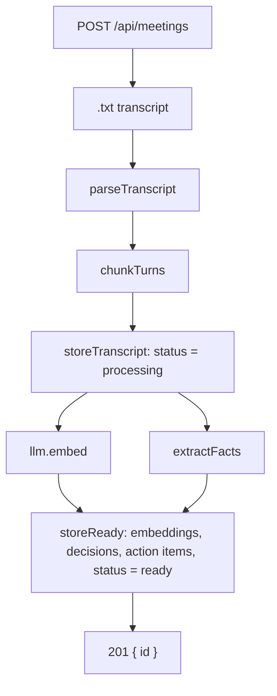
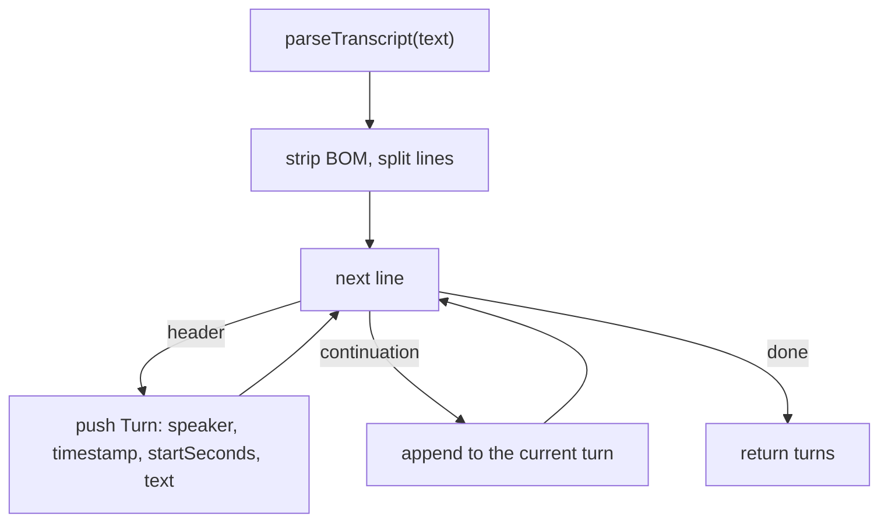
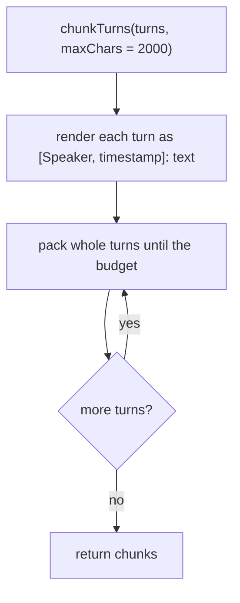
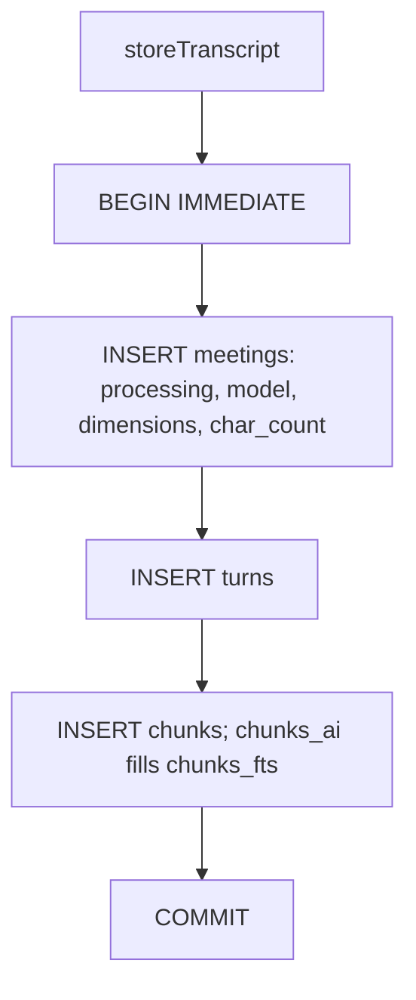
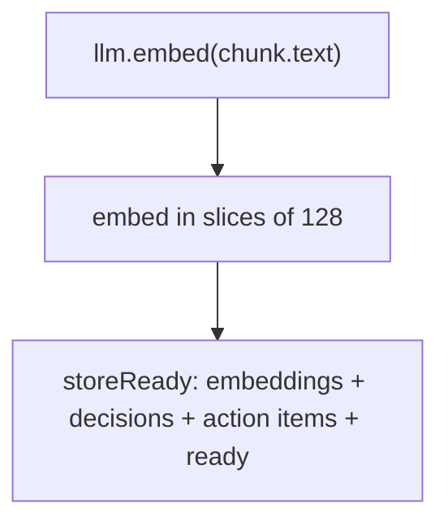
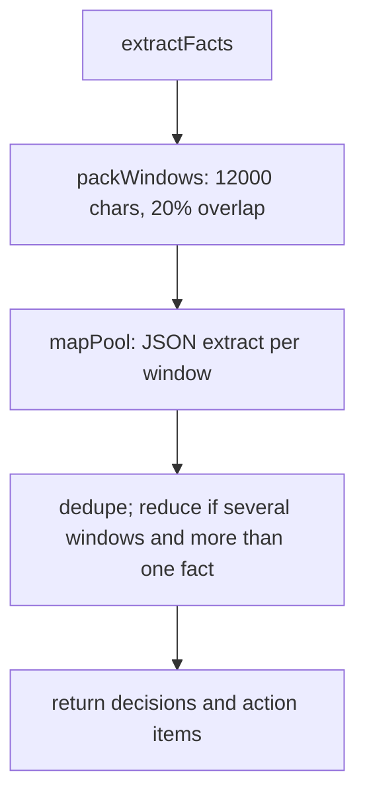

# Ingestion flow

Upload a `.txt` transcript. The server parses speaker turns, packs them into chunks, writes SQLite rows, then embeds those chunks **in parallel with** extracting decisions and action items.

The upload request stays open until ingest finishes, then returns `201 { id }`. **Cancel** or disconnect aborts the work and deletes the meeting if `201` has not been sent. There is no `failed` status.

## High-level ingestion



HTTP entry: [`server/src/routes/meetings.ts`](../../server/src/routes/meetings.ts). Orchestration: [`server/src/ingest/pipeline.ts`](../../server/src/ingest/pipeline.ts) `ingestTranscript`.

- The `.txt` transcript is form field `file`. The meeting title is the filename with a trailing `.txt` stripped.
- Filename must end in `.txt`. Content-Type must be `text/plain` or empty. Multipart allows one file, max 5 MiB.
- Parse and chunk run **before** any `meetings` row exists.
- Extract and embed start together. Ingest waits for embeddings, then joins extract, then one transaction writes `chunk_embeddings`, `decisions`, `action_items`, and `ready`.
- A non-abort extract failure returns empty facts, so ingest can still return `201` with a `ready` meeting and empty panels. Embed failure deletes the meeting.
- A concurrent `GET /api/meetings` can see `processing`. The upload handler does not return until `ready` (or the row is gone).

## Parsing



[`server/src/transcript/parse.ts`](../../server/src/transcript/parse.ts)

Three header forms, first match wins. Bracket and parenthesis clocks may be `MM:SS` or `H:MM:SS`; a bare clock must be three parts:

- `[00:02:01] Ada: text` or `[02:01] Ada: text`
- `Ada (00:02:01): text` or `Ada (02:01): text`
- `00:02:01 Ada: text` — not `01:02 Ada: hello`

`startSeconds` is derived from the clock. Later non-header lines append to the current turn. Blank lines and lines before the first header are ignored. Zero turns throws `ParseError` (`400`).

## Chunking



[`server/src/transcript/chunk.ts`](../../server/src/transcript/chunk.ts)

Packed `text` looks like:

```
Speakers: Ada, Ben
[Ada, 00:02:01]: …
[Ben, 00:02:15]: …
```

The `Speakers:` line is a roster only. Citations are the `[Speaker, timestamp]:` markers on each turn — the same rendering used at chat time.

- Whole turns only; a turn is never split. When the previous chunk held more than one turn, the next chunk may repeat that last turn.
- `endSeconds` is the last turn's `startSeconds`. `chunkIndex` is `0 .. n-1`.

## Persisting



[`server/src/ingest/pipeline.ts`](../../server/src/ingest/pipeline.ts) `storeTranscript`, [`server/src/db/schema.sql`](../../server/src/db/schema.sql)

- `char_count` is `rawText.length`. Chat uses it with **strict less-than** `FULL_CONTEXT_CHAR_THRESHOLD`.
- `chunks_fts` is FTS5 over `chunks.text` (`porter unicode61`). The `chunks_ai` trigger indexes each row as it is inserted; ingest does not write FTS itself.

## Embedding



[`server/src/llm/embed.ts`](../../server/src/llm/embed.ts) `embed`, then [`server/src/ingest/pipeline.ts`](../../server/src/ingest/pipeline.ts) `storeReady`

- The embedded string is the stored chunk `text` (roster plus turns).
- Slices of `EMBED_BATCH_SIZE` (`128`). `text-embedding-3*` also send `dimensions`. Vectors are stored as BLOBs in `chunk_embeddings`. `sqlite-vec` is loaded as an extension for `vec_distance_cosine` at query time; there is no `vec0` virtual table.

## Extracting



[`server/src/extract/window.ts`](../../server/src/extract/window.ts), [`server/src/extract/facts.ts`](../../server/src/extract/facts.ts), [`server/src/llm/chat.ts`](../../server/src/llm/chat.ts) `completeJson`

- Windows are packed from turns (not `chunk.text`), so each utterance still has its clock. Mapped at `EXTRACT_CONCURRENCY` (`8`). A turn longer than 12k characters is sliced.
- Duplicate fact text (case- and whitespace-insensitive) collapses to one row. Action items keep the first text and fill in a later `owner` / `due` when the first row lacked them.
- Reconcile runs only when there is more than one window **and** more than one extracted fact. Large meetings may reduce in groups (`MERGE_MAX_CHARS`). A single window, or a flatten that yields at most one fact, skips it.
- Non-abort extract errors become empty facts so ingest can still finish.
