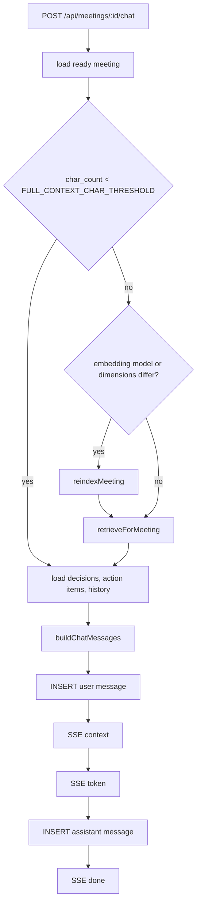
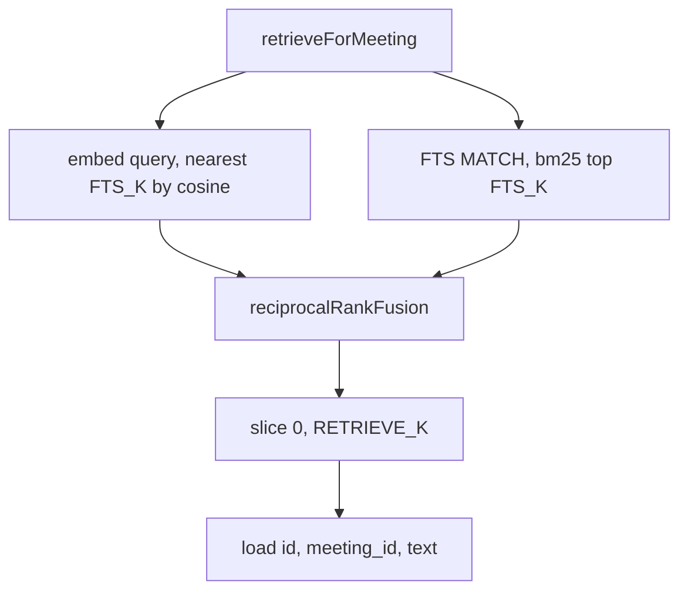
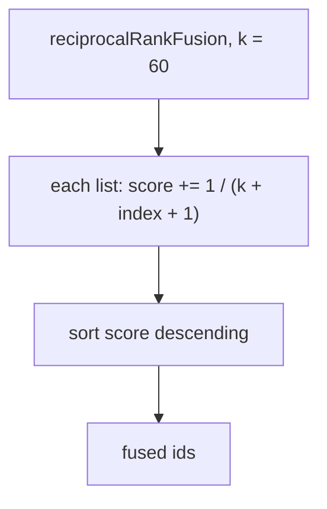
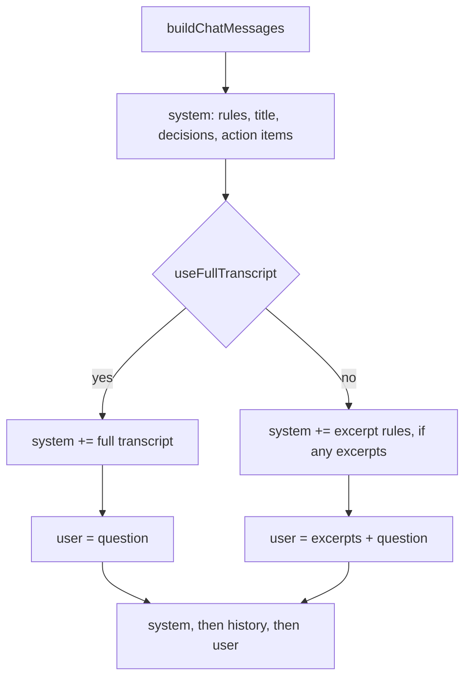

# Retrieval flow

Retrieval runs inside `POST /api/meetings/:id/chat` → [`answerQuestion`](../../server/src/rag/chat.ts).

Every query is limited to the open meeting. Short meetings (`char_count < FULL_CONTEXT_CHAR_THRESHOLD`) skip retrieval and send the full transcript instead. `char_count` is the uploaded file’s `rawText.length`, stored at ingest.

## High-level retrieval

HTTP: [`server/src/routes/chat.ts`](../../server/src/routes/chat.ts). Orchestration: [`server/src/rag/chat.ts`](../../server/src/rag/chat.ts) `answerQuestion`. Reindex: [`server/src/rag/reindex.ts`](../../server/src/rag/reindex.ts).

- `body.message` is a non-empty string after trim. The meeting must exist (`404`) and be `ready` (`409` if still `processing`).
- Reindex runs **before** retrieve, and only on the retrieval path, when stored `embedding_model` / `embedding_dimensions` do not match process config. It replaces `chunk_embeddings` for that meeting; it does not re-chunk.
- Both paths load decisions, action items, and recent history. Full transcript: stored turns go on the **system** message. Hybrid retrieve: excerpts go on the **user** message.
- History is the last `CHAT_HISTORY_TURNS` `messages` rows (user and assistant mixed), loaded **before** the current user row is inserted, so a question is never part of its own history. In the prompt those rows are oldest-first.
- Retrieve (and reindex) run in `answerQuestion` **before** the user row is inserted. The OpenAI chat stream starts when SSE begins, **after** that `INSERT`.
- SSE events: `context` (`{ useFullTranscript }`), then `token` (`{ text }`), then `done`. Citations are inline in the answer; retrieved chunks are not sent on the wire.
- On generation failure: `error` (`{ error }`), no `done`. If any tokens arrived, that partial assistant row is stored; an empty stream stores the user row only.
- **Stop** or leaving the meeting closes the request. Abort before the user `INSERT`: `204`, no messages. Abort mid-stream: user row kept, no assistant row, stream ends with no `error` or `done`.

## Retrieving

[`server/src/rag/retrieve.ts`](../../server/src/rag/retrieve.ts)

The query embedding runs while the FTS query executes. Both lists use `LIMIT` `FTS_K` (default `8`); `RETRIEVE_K` trims the fused list. Only `id`, `meeting_id`, and `text` are read from those rows — retrieved chunks are not sent on the wire.

- **Lexical:** take tokens that contain a letter or digit, quote each, join with `OR`, and rank by bm25 within this meeting. A question with no such tokens skips FTS (vector still runs). An FTS error returns an empty lexical list.
- **Vector:** embed the query string unchanged, then nearest `chunk_embeddings` for this meeting (cosine distance, lowest first). A non-abort embed failure returns an empty vector list, so FTS-only still works.

## Fusing

[`server/src/rag/fuse.ts`](../../server/src/rag/fuse.ts)

An id that appears in both lists gets both contributions. `index` is 0-based, so first place is `1 / 61`. Equal scores break ties toward the smaller chunk id.

## Prompting

[`server/src/rag/prompt.ts`](../../server/src/rag/prompt.ts)

- System always includes the rules, title, decisions, and action items. Empty lists render as `None recorded.` On the full-transcript path it also includes the stored turns rendered as `[Speaker, timestamp]: text`.
- Retrieved path: excerpt text on the user message. Excerpt-format rules go on the system message only when at least one chunk was retrieved; otherwise the user message says `None retrieved.`
