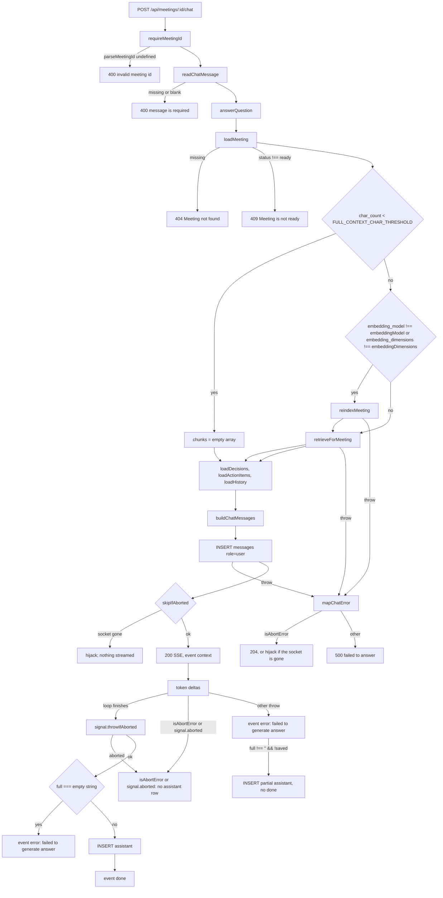
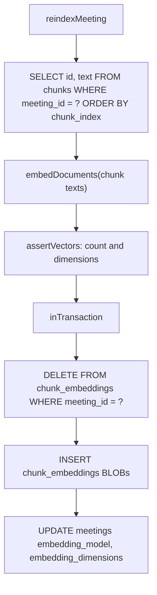
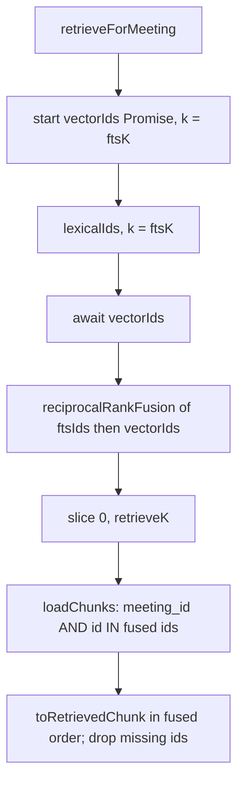
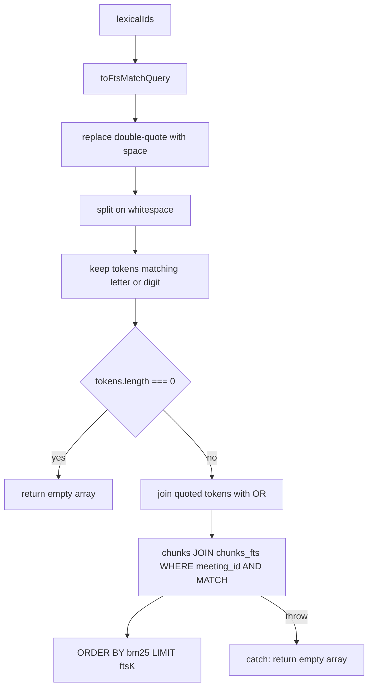
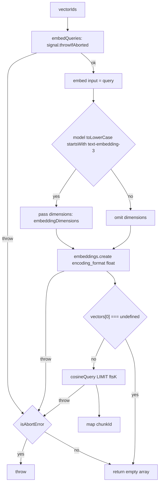
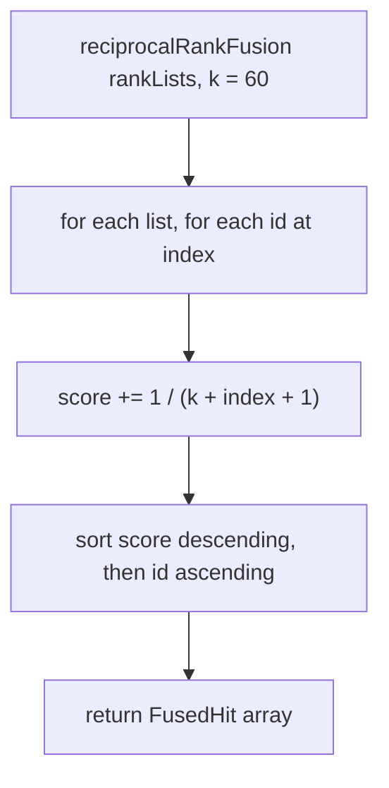
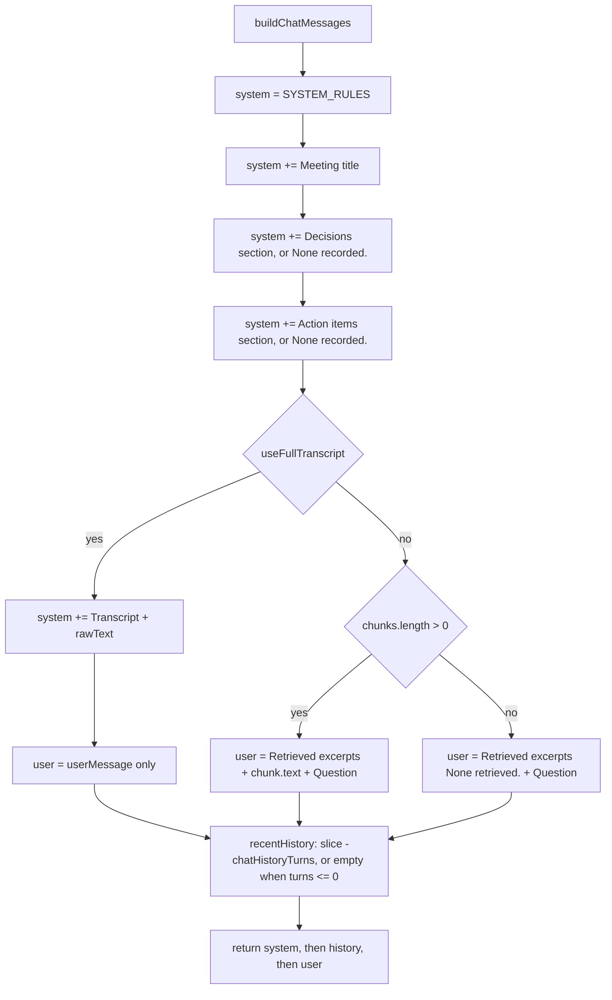

# Retrieval flow

There is no retrieve HTTP route. Retrieval runs inside `POST /api/meetings/:id/chat` → [`answerQuestion`](../../server/src/rag/chat.ts). Meetings with `char_count < FULL_CONTEXT_CHAR_THRESHOLD` skip retrieval and skip reindex.

Every query is filtered by the open meeting’s `meeting_id`.

## High-level retrieval

HTTP: [`server/src/routes/chat.ts`](../../server/src/routes/chat.ts). Orchestration: [`server/src/rag/chat.ts`](../../server/src/rag/chat.ts) `answerQuestion`. Id parse: [`server/src/routes/http.ts`](../../server/src/routes/http.ts) `parseMeetingId` (`/^[1-9][0-9]*$/`, then `Number.isSafeInteger`).

The route validates the request, then hands off to `answerQuestion`:

- `readChatMessage` requires `body.message` to be a string whose trim is non-empty; anything else is `400 message is required`.
- `answerQuestion` calls `throwIfAborted` before `loadMeeting`. Everything it throws, plus a failing user-row insert, goes through `mapChatError`: abort first (**204** or hijack), then `404 Meeting not found`, `409 Meeting is not ready`, and `500 failed to answer` for anything else.
- `shouldUseFullTranscript` is `charCount < threshold`. With the default threshold `24000`, `23999` takes the full-transcript path and `24000` does not.
- Reindex runs only when embeddings are stale **and** the full-transcript path is not taken.

`buildAnswer` assembles the same prompt on both paths; only the placement of the meeting content differs:

- It always loads `decisions` and `action_items` (`ORDER BY id`) plus history, including on the full-transcript path.
- Full transcript: `citations` is `[]` and `raw_text` goes on the **system** message. Retrieved excerpts are never added.
- Hybrid retrieve: excerpts go on the **user** message. Decisions and action items stay on the system message.
- History is `SELECT role, content FROM messages WHERE meeting_id = ? ORDER BY created_at DESC, id DESC LIMIT ?` bound to `chatHistoryTurns`, then reversed. The limit counts **message rows**, not user/assistant pairs, and `chatHistoryTurns <= 0` loads nothing.
- History is read inside `answerQuestion`, **before** the route inserts the current user row, so a question is never part of its own history.

The route then persists and streams:

- The order is: `answerQuestion` returns, insert the user row, `skipIfAborted`, start SSE. A client that left during that window ends the request there, with nothing streamed.
- `sseChunks` yields `context` `{ citations, useFullTranscript }` first. `streamChat` is an async generator, so `client.chat.completions.create` only runs when that generator is first iterated, which is after the `context` event.
- After the token loop, `signal.throwIfAborted()` runs again before anything is persisted. A stream that produced no tokens yields `error` `failed to generate answer` and writes no assistant row.
- An abort while streaming keeps the user row and writes no assistant row; `sseChunks` simply returns. The response is already `200` by then, so the client just sees the event stream stop, with no `error` and no `done`.
- An abort anywhere inside `answerQuestion` — the initial `throwIfAborted`, reindex, or the query embedding in `retrieveForMeeting` — happens before the user row exists, so that row is never written and the request ends **204** or hijacked.
- A non-abort throw while streaming yields `error` `failed to generate answer` and then persists the partial answer when `full !== '' && !saved` (persist errors are logged). No `done` event is sent.

## Reindexing

[`server/src/rag/chat.ts`](../../server/src/rag/chat.ts) `reindexMeeting`

- Stale means `meeting.embedding_model !== config.embeddingModel` or `meeting.embedding_dimensions !== config.embeddingDimensions`.
- The order is: load chunks, `throwIfAborted`, embed, `assertVectors`, `throwIfAborted`, then the replace transaction. Both the assert and the abort check happen before any write, so a wrong count or dimension leaves the existing embeddings in place.
- The transaction deletes and reinserts every embedding for the meeting, then stamps `embedding_model` and `embedding_dimensions` so the next chat sees a fresh index.
- Does not rewrite `chunks`, `chunks_fts`, `turns`, `decisions`, or `action_items`.
- Uses the same `embedDocuments` path as ingest (chunk texts sent unchanged; slices of `EMBED_BATCH_SIZE` 128).

## Retrieving

[`server/src/rag/retrieve.ts`](../../server/src/rag/retrieve.ts)

- `vectorIds` is started first, then `lexicalIds` runs, then the vector promise is awaited. The embedding request is therefore in flight while the synchronous FTS query executes.
- **Both** lists are requested with `LIMIT` / `k = config.ftsK` (default `8`); `RETRIEVE_K` only trims the fused list afterwards, via `.slice(0, config.retrieveK)`. Either list may be shorter than `k`, including empty.
- `loadChunks` with zero ids returns an empty Map and does not run SQL. Missing ids after `IN (...)` are dropped.
- `RetrievedChunk.score` is the RRF score, not cosine distance.

### Lexical (`lexicalIds`)

[`server/src/rag/retrieve.ts`](../../server/src/rag/retrieve.ts) `toFtsMatchQuery`, `lexicalIds`

- Token test is `/[\p{L}\p{N}]/u`, so a token survives only if it contains a letter or a digit. Operator-only input such as `" * ( )` leaves no tokens and skips FTS entirely, returning `[]`.
- Every surviving token is wrapped in double quotes and the tokens are joined with `OR`, which both neutralizes FTS5 operators in user text and makes the match a union rather than a conjunction.
- SQL: `WHERE chunks.meeting_id = ? AND chunks_fts MATCH ? ORDER BY bm25(chunks_fts) LIMIT ?`. Any throw from that query is swallowed and becomes `[]`, so a malformed match degrades to vector-only retrieval instead of failing the answer.

### Vector (`vectorIds`)

[`server/src/rag/retrieve.ts`](../../server/src/rag/retrieve.ts) `vectorIds`, [`server/src/llm/embed.ts`](../../server/src/llm/embed.ts) `embedQueries`, [`server/src/db/client.ts`](../../server/src/db/client.ts) `cosineQuery`

- Query strings are sent unchanged and the returned vectors are L2-normalized, exactly as on the ingest side. `embedQueries` uses the same `embed()` loop as documents (`EMBED_BATCH_SIZE` `128`), so a single chat query is one slice, and models whose lowercased name starts with `text-embedding-3` also send `dimensions`.
- `vectorIds` wraps the whole thing in one `try`. An abort is rethrown; anything else — a failed request, a count mismatch, an `EmbeddingDimensionError`, a failing `cosineQuery` — becomes `[]`, so the answer falls back to lexical-only retrieval.
- `cosineQuery`: `SELECT chunk_id AS chunkId, vec_distance_cosine(embedding, ?) AS distance FROM chunk_embeddings WHERE meeting_id = ? ORDER BY distance LIMIT ?`. Lower distance first. The query vector is bound with `toVectorBlob` (Float32Array bytes as `Uint8Array`). `vec_distance_cosine` comes from the `sqlite-vec` extension loaded in `openDb`.

## Fusing

[`server/src/rag/fuse.ts`](../../server/src/rag/fuse.ts)

- Rank uses 0-based `index`, so first place is `1 / (60 + 0 + 1) = 1/61`.
- The same id in both FTS and vector lists sums both contributions.
- `reciprocalRankFusion([])` and `reciprocalRankFusion([[], []])` return `[]`.

## Prompting

[`server/src/rag/prompt.ts`](../../server/src/rag/prompt.ts)

- System always includes the rules, title, decisions, and action items. On the full-transcript path it also includes `## Transcript\n${rawText}`.
- Full-transcript user content is exactly `userMessage`. Chunk texts passed into `buildChatMessages` are not added.
- Retrieved path user content is `## Retrieved excerpts\n` + `chunk.text` values joined by `\n\n` (or `None retrieved.`) + `\n\n## Question\n` + `userMessage`.
- `chatHistoryTurns <= 0` drops history (`turns > 0 ? history.slice(-turns) : []`). For a positive value the slice is a no-op, since `loadHistory` already applied the same bound as a SQL `LIMIT`.
- `buildAnswer` then calls `llm.streamChat(messages, signal)` ([`server/src/llm/chat.ts`](../../server/src/llm/chat.ts)). `streamChat` calls `throwIfAborted` before `completions.create`. Sampling is `chatSampling(model, 0.2)`: omit `temperature` when the model name matches `/^(gpt-5|o1|o3|o4)/i`; otherwise `temperature: 0.2`.
- It tries `stream: true` first and yields `choices[0].delta.content` whenever that is non-empty. Only an `APIError` with status `400` triggers the fallback, one non-streaming call that yields `message.content` if present; anything else, abort included, propagates. The `try` also covers the yield loop, so a `400` raised part-way through the stream falls back after tokens have already been sent.
