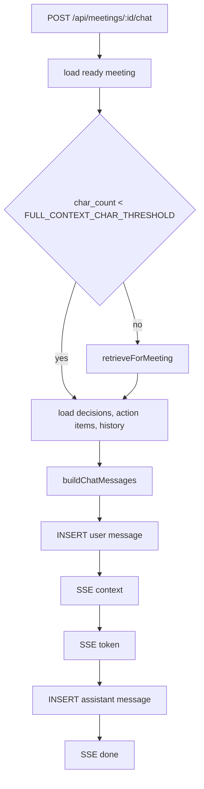
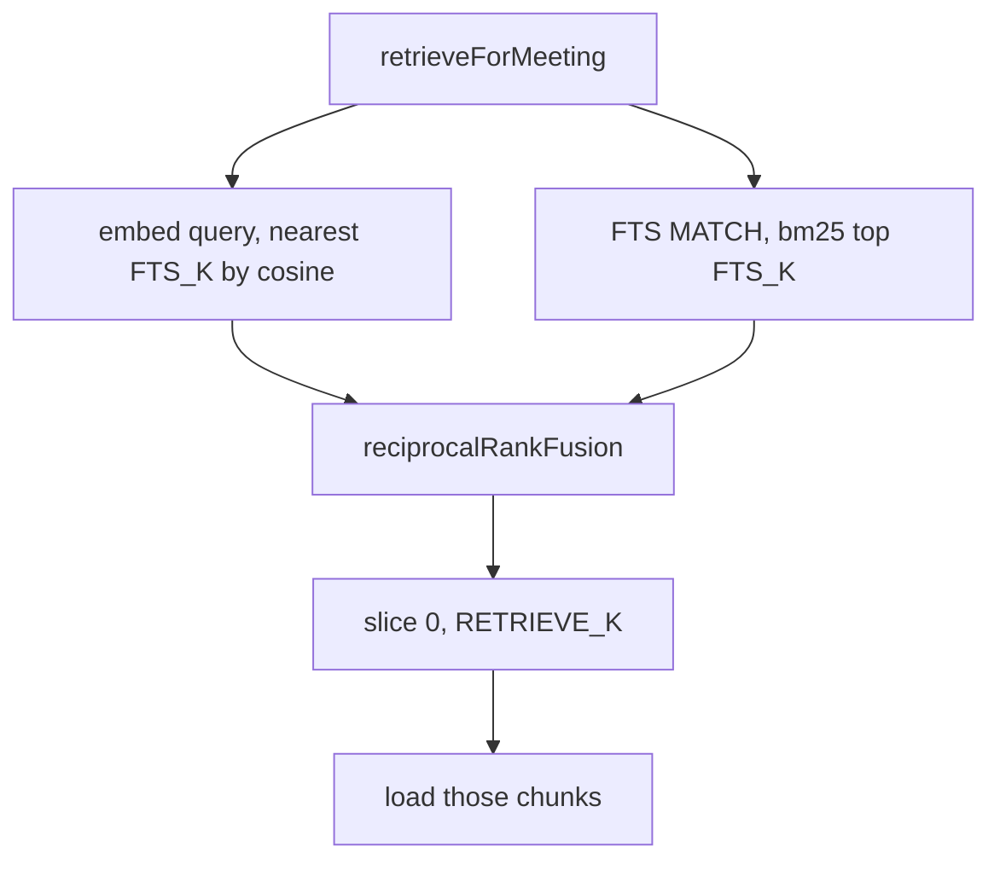
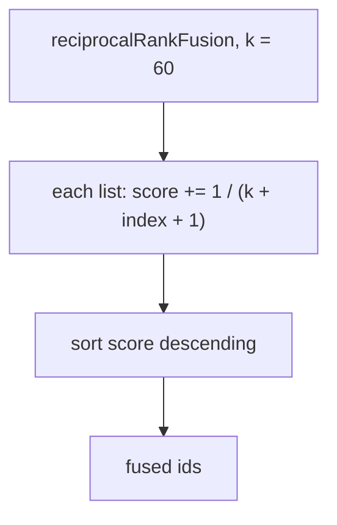
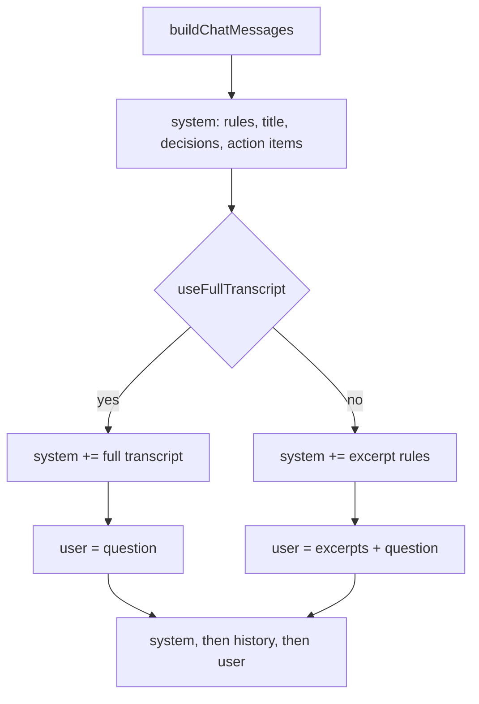

# Retrieval flow

Retrieval runs inside `POST /api/meetings/:id/chat` → [`answerQuestion`](../../server/src/rag/chat.ts).

Every query is limited to the open meeting. Short meetings (`char_count < FULL_CONTEXT_CHAR_THRESHOLD`) skip retrieval and send the full transcript instead.

## High-level retrieval

HTTP: [`server/src/routes/chat.ts`](../../server/src/routes/chat.ts). Orchestration: [`server/src/rag/chat.ts`](../../server/src/rag/chat.ts) `answerQuestion`.

- `body.message` is a non-empty string. The meeting must exist and be `ready`.
- Both paths load decisions, action items, and recent history. Full transcript: stored turns go on the **system** message. Hybrid retrieve: excerpts go on the **user** message.
- History is loaded **before** the current user row is inserted, so a question is never part of its own history.
- SSE events: `context` (`{ useFullTranscript }`), then `token` (`{ text }`), then `done`. Citations are inline in the answer; retrieved chunks are not sent on the wire.

## Retrieving

[`server/src/rag/retrieve.ts`](../../server/src/rag/retrieve.ts)

The query embedding runs while the FTS query executes. Both lists use `LIMIT` `FTS_K` (default `8`); `RETRIEVE_K` trims the fused list.

- **Lexical:** quote each token from the question, join with `OR`, and rank by bm25 within this meeting.
- **Vector:** embed the query string unchanged, L2-normalize, then nearest `chunk_embeddings` for this meeting (cosine distance, lowest first).

## Fusing

[`server/src/rag/fuse.ts`](../../server/src/rag/fuse.ts)

An id that appears in both lists gets both contributions. `index` is 0-based, so first place is `1 / 61`.

## Prompting

[`server/src/rag/prompt.ts`](../../server/src/rag/prompt.ts)

- System always includes the rules, title, decisions, and action items. On the full-transcript path it also includes the stored turns rendered as `[Speaker, timestamp]: text`.
- Retrieved path: excerpt rules on the system message, excerpt text on the user message.
