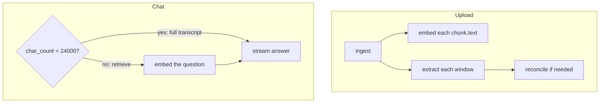

# LLM calls

What this process sends to OpenAI, and what bounds each part. Size is **characters** and **counts** — there is no tokenizer, and chat completions do not set `max_tokens`.

One SDK client ([`createLlm`](../server/src/llm/client.ts)) makes every call (`OPENAI_BASE_URL`, default `https://api.openai.com/v1`). `CHAT_MODEL` is used for extract and answers; `EMBEDDING_MODEL` for vectors. Defaults below match [`.env.example`](../.env.example). When the calls run: [ingestion](flows/ingestion.md), [retrieval](flows/retrieval.md).

## Three shapes

| Shape | API | Code | Payload |
| --- | --- | --- | --- |
| Embed | `embeddings.create` | [`embed`](../server/src/llm/embed.ts) | Array of strings: each `chunk.text`, or the question. |
| Extract | `chat.completions.create` + `json_object` | [`completeJson`](../server/src/llm/chat.ts) | System rules + one window, then reconcile if several windows still have more than one fact after combining (exact-deduped). |
| Answer | `chat.completions.create` + `stream` | [`streamChat`](../server/src/llm/chat.ts) | System + history + one user message. |

Extract always sends `json_object`. Reasoning models (`gpt-5*`, `o1` / `o3` / `o4` — including the default `CHAT_MODEL`) omit `temperature` on extract and answers, and may set `reasoning_effort` on extract only; other models send `temperature` 0 on extract and 0.2 on answers. The SDK client sets `maxRetries: 0`.

On the retrieve path, if stored `embedding_model` / `embedding_dimensions` do not match config, existing `chunk.text` is re-embedded first (no re-chunk). Full-transcript chats skip that.

## Limits at a glance

| Bound | Default | Caps |
| --- | --- | --- |
| Chunk text | 2000 chars | One embed string. A longer **turn** stays whole, so a chunk can exceed this. |
| Extract window | 12,000 chars | Packed window text on the extract user message. ~20% overlap. Turn-aligned windows never reuse the previous window’s first turn. |
| Extract concurrency | 8 | Window extract calls, and multi-extract reconcile groups, at a time. |
| Embed HTTP batch | 128 strings | One `embeddings.create`. |
| Chat path | `char_count` **&lt; 24,000** | Full transcript vs retrieve. `char_count` is the decoded upload (`rawText.length`), not the prompt. |
| Excerpts | at most **8** chunks | Retrieve-path user message. Packed to ~2000 chars; a longer turn makes a bigger chunk. |
| History | **8** message rows | Stored questions and answers, not old excerpts. |
| Reconcile group | 60,000 chars | Pack window extracts until the next one would exceed this. One extract may itself be larger. |
| Upload `.txt` | 5 MiB | Ingest. POST body 6 MiB (multipart wrapping). |
| Chat JSON | 1 MiB | Fastify default `bodyLimit` on `{ "message": … }`. |

## Embed

[`embed`](../server/src/llm/embed.ts) sends `input` (string array) and `encoding_format: float`. For `text-embedding-3*` it also sends `dimensions` (default 1536).

- **Ingest / reindex** — each [`chunkTurns`](../server/src/transcript/chunk.ts) `text`: `Speakers: …` (names, no clocks) then `[Speaker, timestamp]:` turns. Clocks stay on turns so a cite cannot pair a roster name with a window boundary.
- **Chat (retrieve path)** — the question, unchanged.

Empty `input` skips the API. Batches of 128. Vectors are stored as returned.

## Extract

Windows come from **turns**, not retrieval chunks ([`packWindows`](../server/src/extract/window.ts)). Prompts: [`extractFacts`](../server/src/extract/facts.ts).

**Each window** — two messages:

- system: extract rules + JSON schema. More than one window → also ask for a 2–4 sentence `summary` (stored clipped to 1000 chars).
- user: `Transcript:\n` + that window (up to 12,000 chars of `[Speaker, timestamp]:` lines). A single oversize turn is sliced to 12,000 with the same ~20% overlap.

**Reconcile** — only if there were several windows **and** more than one fact after combining them (decisions + action items, exact-deduped).

Each window extract is `{ summary, facts }`. Extracts are packed in order; a new group starts when adding the next `JSON.stringify(extract)` would push the group over `MERGE_MAX_CHARS` (60,000). A lone extract larger than 60,000 is still one group.

Then:

1. **One group** — one reconcile LLM call (window summaries are still present).
2. **Several groups** — each group of two or more extracts is reconciled (batches of 8). A group of one extract is passed through. Every result is stored as `{ summary: '', facts }` and packed again, so the second pack can shrink even when the first overflowed.
3. **Second pack fits in one group** — one more reconcile call over every group’s facts. Summaries are empty on this call.
4. **Second pack still several groups** — concatenate and exact-dedupe those groups. No further LLM (the livelock guard). The model never sees them in one prompt.

A reconcile call is keep-only-existing-items rules plus `JSON.stringify({ summaries, decisions, actionItems })` for **that group** (facts already flattened and exact-deduped). Kept rows are the **original** items, not the model’s wording. Match is case-insensitive collapsed text, or a unique substring if both sides are at least 10 characters. If it keeps nothing, or unmatched items outnumber kept ones, the flattened group is used instead.

## Answer

[`buildChatMessages`](../server/src/rag/prompt.ts) always sends **system**, then **history**, then **one user**.

**System (both paths)**

1. Cite this meeting only; copy `[Speaker, timestamp]` from the supporting turn.
2. `Meeting title: …`
3. `## Decisions` / `## Action items` — every stored row as a bullet (speaker/clock; owner/due on actions), or `None recorded.` (no cap).

**Short meeting** (`char_count` &lt; 24,000) — system also gets `## Transcript` as [`renderTurns`](../server/src/transcript/parse.ts) (not the raw upload). User is only the question. No query embed.

**Long meeting** — user is `## Retrieved excerpts` (at most 8 `chunk.text`s, or `None retrieved.`) then `## Question`. System adds excerpt-format rules if anything was retrieved. The question is embedded; FTS runs in parallel; both lists are capped at `FTS_K` (8), fused, then trimmed to `RETRIEVE_K` (8).

**24,000 is not a `streamChat` cap.** It only chooses the path. The prompt can still be larger than 24,000 characters: rendered turns are not `char_count`, facts are uncapped, and history is eight **rows** with no per-row char limit. On the retrieve path the transcript is replaced by at most eight excerpts (packed to ~2000 chars, more if a turn overflowed), but facts + history + the question still have no extra trim.

History is the last 8 stored **message rows** (user and assistant mixed — not old excerpts), oldest first, loaded before this question is saved. Older rows drop. A long answer is one of those eight rows. Nothing truncates a row. A partial assistant row is stored only if generation failed after tokens; Stop does not save a partial.

The OpenAI completion starts after the SSE `context` event. If it fails (context length included) or yields no tokens, the stream emits `error: failed to generate answer`. If streaming returns 400 with `param: 'stream'` (or no `param`), the same messages are retried without `stream`. This repo does not count tokens or shrink the prompt.

Constants: [docs/flows](flows/README.md#constants).
